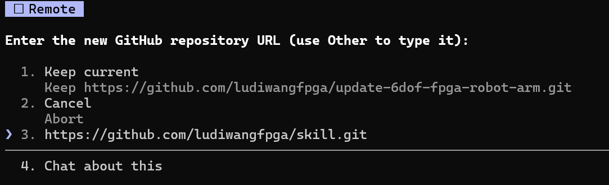
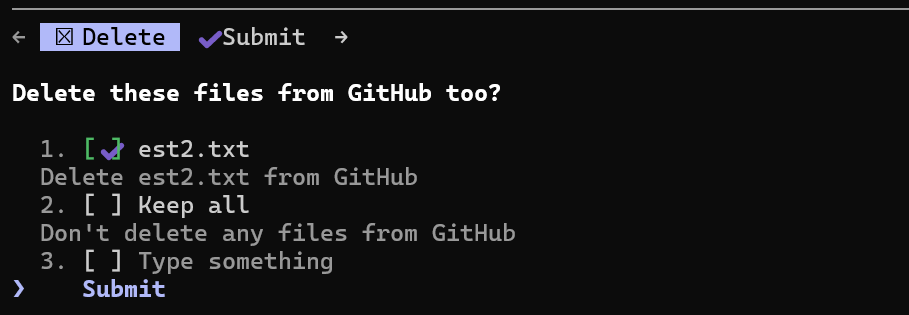

# save-to-github

One-command GitHub sync for Claude Code. Type `/save!` to push your code.

## Features

- **One-click sync** — auto add, commit, and push
- **Smart delete handling** — asks once per deleted file whether to remove from GitHub (remembers your choice)
- **Push confirmation** — Push / Cancel / Change remote selector before pushing
- **Manage remote files** — view and delete files already on GitHub
- **Change remote** — switch target repository anytime
- **Auto-create repos** — automatically creates new GitHub repos if they don't exist
- **Auto-setup** — installs gh CLI and opens GitHub login on first use (Windows)
- **Sensitive file protection** — skips .env, credentials, keys, etc.
- **No git repo? No problem** — asks to initialize one if not found

## Screenshots

### Change Remote


### Manage Files


## Install

```bash
git clone https://github.com/ludiwangfpga/save-to-github.git
cd save-to-github
python install.py
```

This copies the skill files to `~/.claude/` so they work globally across all projects.

## Requirements

- Python 3.8+
- Git
- Claude Code CLI or Desktop

Optional (auto-installed on first use):
- [GitHub CLI](https://cli.github.com/) — needed only for creating new repos

## Usage

In any Claude Code conversation, type:

```
/save!
```

### When changes exist

1. Detects new/modified/deleted files
2. For deleted files: asks which to remove from GitHub (remembers choices)
3. Shows **Push** / **Cancel** / **Change remote** selector
4. Commits and pushes

### When nothing to sync

Shows options to:
- **Manage files** — select and remove files from GitHub
- **Change remote** — switch to a different repository
- **Done** — exit

### When not in a git repo

Shows options to:
- **Initialize** — create a new git repo in current directory
- **Cancel** — abort

## File Structure

```
commands/save!.md    — Claude Code slash command definition
scripts/save.py      — Main Python script (git operations)
scripts/gh_login.bat — GitHub CLI login helper (Windows)
install.py           — Installer
```

## Uninstall

```bash
rm ~/.claude/commands/save!.md
rm ~/.claude/scripts/save.py
rm ~/.claude/scripts/gh_login.bat
```
